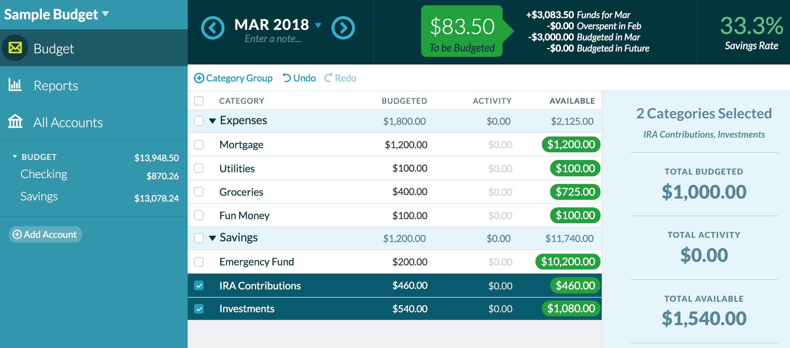
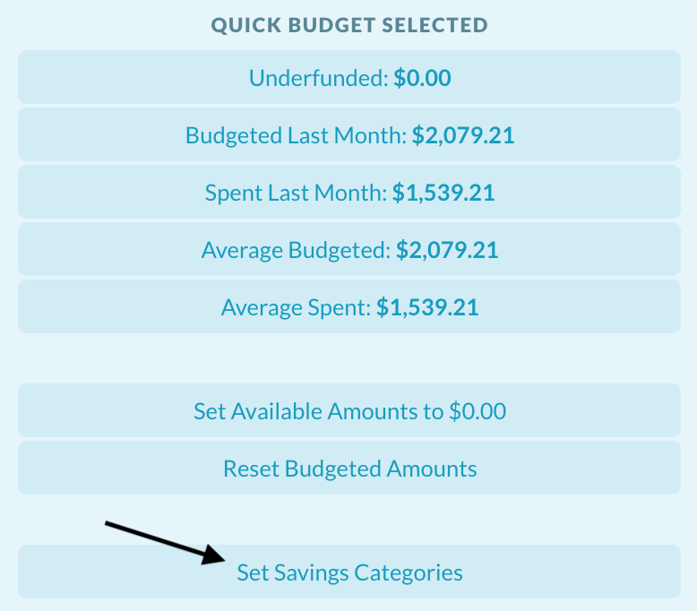
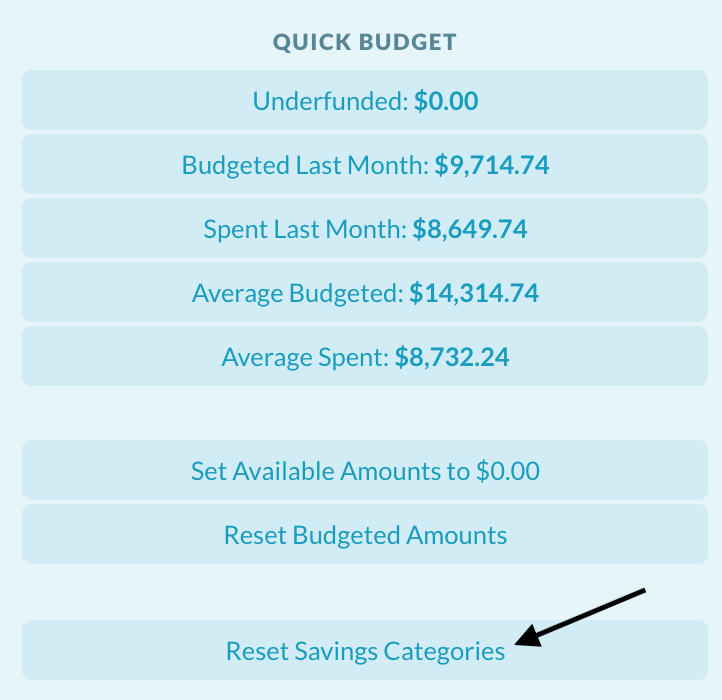

# YNAB Savings Rate

> Disclaimer: Please don't trust strangers with access to your financial records! Verify the code before installation.

## Installation
1. Install [Tampermonkey][tampermonkey], a popular userscript manager for Chrome.
2. From the Tampermonkey icon in the Chrome toolbar, select "Create a new script..."
3. Copy and paste the contents of `ynab-savings-rate.js` into your new script.

## Usage
- Select categories to see their savings rate.
- You can save the selected categories by clicking the "Save Savings Categories" button in the inspector. Saved categories will be used to calculate your savings rate whenever no categories are checked.
- You can reset the saved categories by clicking the "Reset Savings Categories" button in the inspector when no categories are checked.

## Screenshots

 

[tampermonkey]: https://chrome.google.com/webstore/detail/tampermonkey/dhdgffkkebhmkfjojejmpbldmpobfkfo?hl=en
